# The Hollow Shell
## TryHackMe • Hacker Holidays 2026 • Day 10

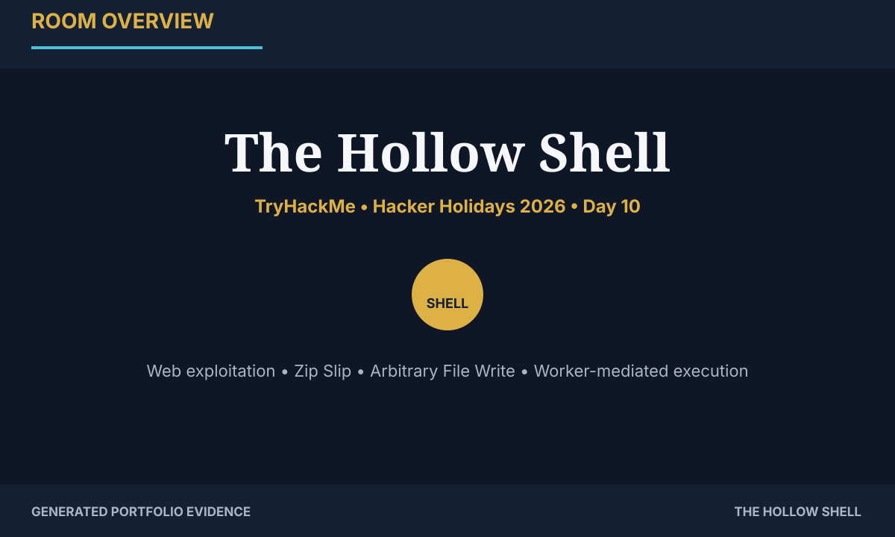

<div class="badge-row">
<span class="badge">Web</span>
<span class="badge">Medium</span>
<span class="badge">Zip Slip</span>
<span class="badge">Arbitrary File Write</span>
<span class="badge">Reverse Shell</span>
</div>

> **Flag values are intentionally redacted.** The walkthrough focuses on the reasoning, exploitation chain, validation steps, and defensive lessons.

## Objective

Reach the Byte Lotus Hotel's Shoreline Display service, identify the unsafe archive extraction behavior, turn path traversal into arbitrary file write, abuse the background worker's hook processing, and obtain the final application shell.

## Attack chain at a glance

```text
Recon → 405 clue → source disclosure → staff portal → ZIP upload
     → Zip Slip → static proof → hooks/ write → worker execution
     → reverse shell → roomservice → flag.txt (redacted)
```

## Technical highlights

| Stage | Finding |
|---|---|
| Discovery | TCP/22 and TCP/5000 exposed |
| Enumeration | `/upload` exists but rejects GET with 405 |
| Disclosure | Staff login details exposed in source comments |
| Initial access | Shoreline Display dashboard |
| Vulnerability | Zip Slip path traversal in archive extraction |
| Validation | Write outside extraction root, then confirm via `static/` |
| Execution | Worker consumes content from `hooks/` |
| Final access | Reverse shell as `roomservice` |

## Walkthrough

### 01 — Reconnaissance

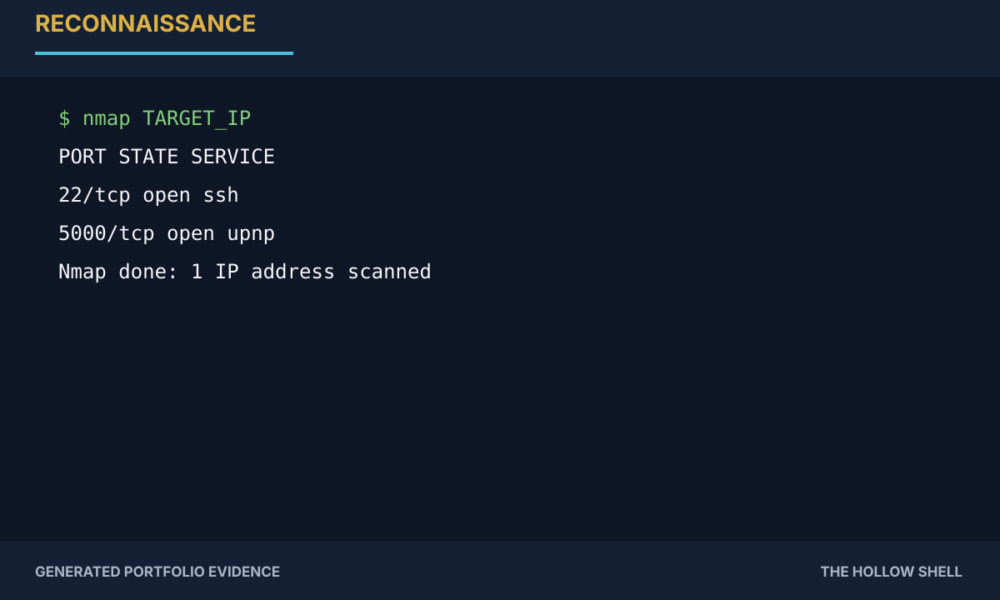

The web application is exposed on TCP/5000. The first goal is simply to establish the attack surface.

### 02 — Find the hidden upload route

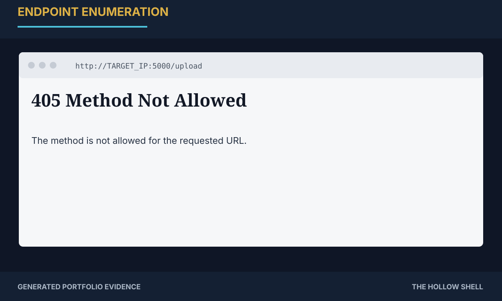

The 405 is valuable enumeration feedback: the endpoint is real, but the browser's GET method is not accepted.

### 03 — Inspect client-side source

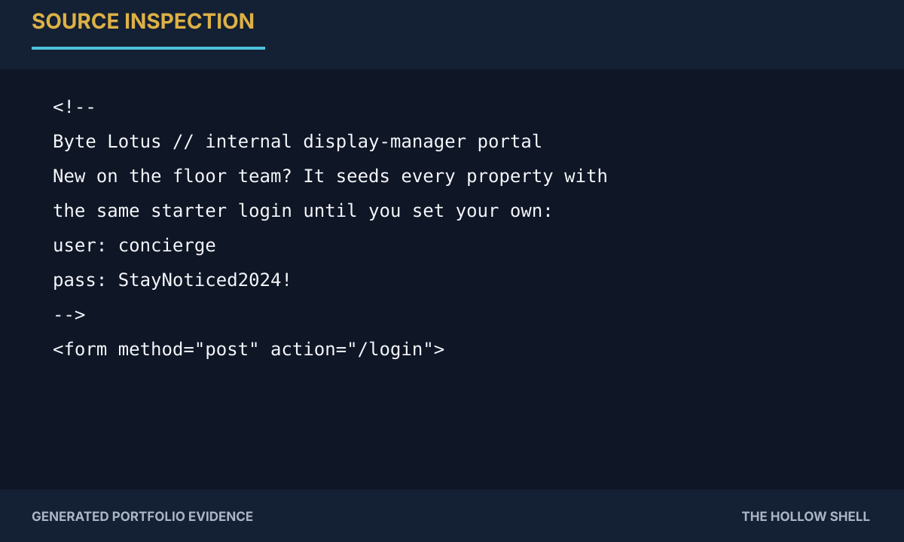

The page source exposes the lab's default staff login. This gives access to the upload workflow.

### 04 — Understand the upload design

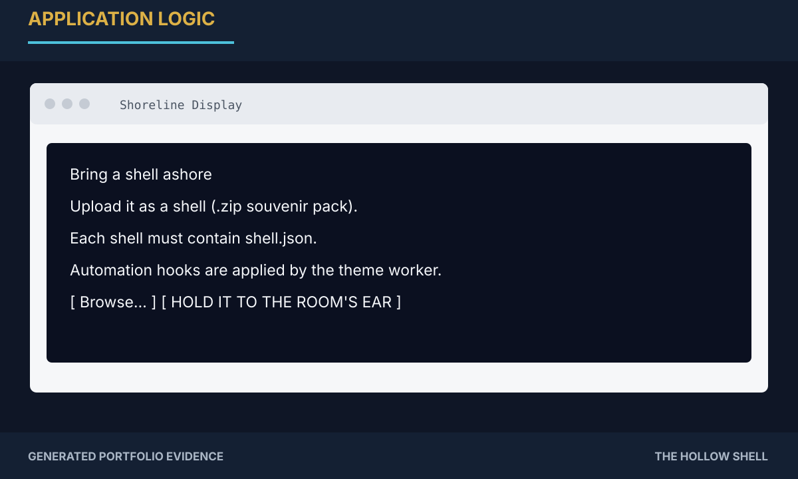

The dashboard requires `shell.json` and mentions automation hooks handled by a background worker. That worker clue becomes the execution path later.

### 05 — Establish a baseline upload

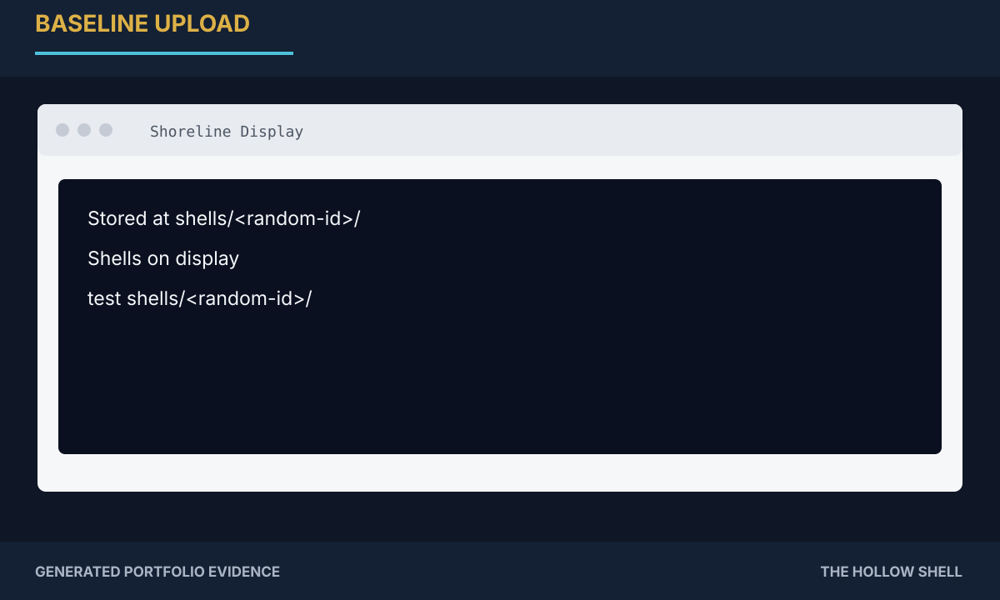

A normal shell archive is extracted beneath a per-upload directory. This defines the boundary the exploit will attempt to cross.

### 06 — Prove Zip Slip safely

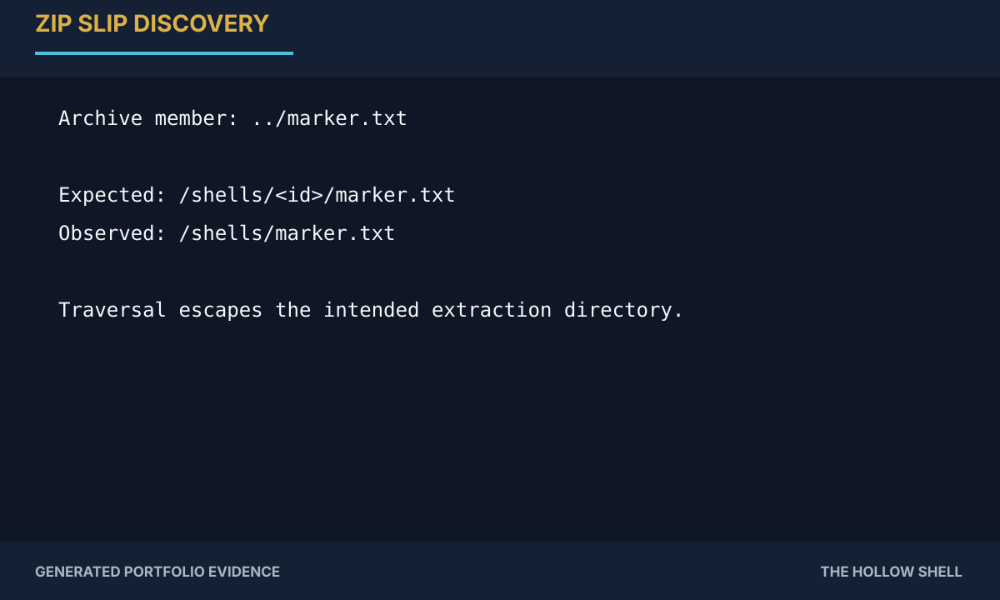

A crafted member such as `../marker.txt` escapes the intended directory. The marker is deliberately harmless.

### 07 — Confirm arbitrary file write

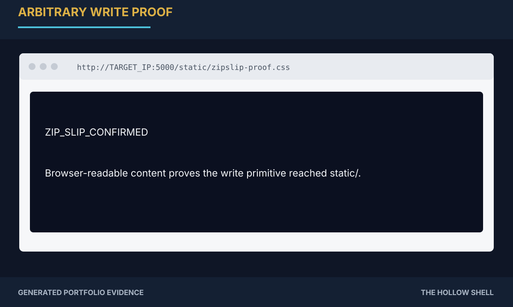

Writing `../../static/zipslip-proof.css` produces a browser-readable confirmation, demonstrating that the traversal reaches a separate application path.

### 08 — Reach the worker hook location

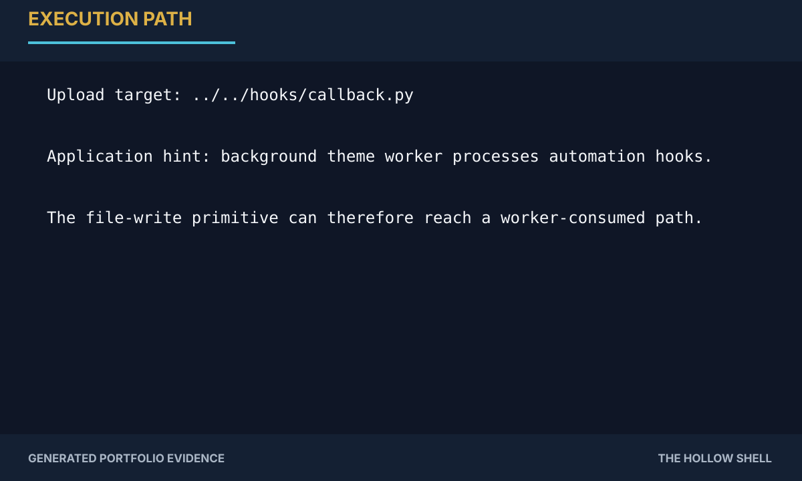

The next step is to place a controlled Python callback in the worker's hook directory.

### 09 — Build the archive payload

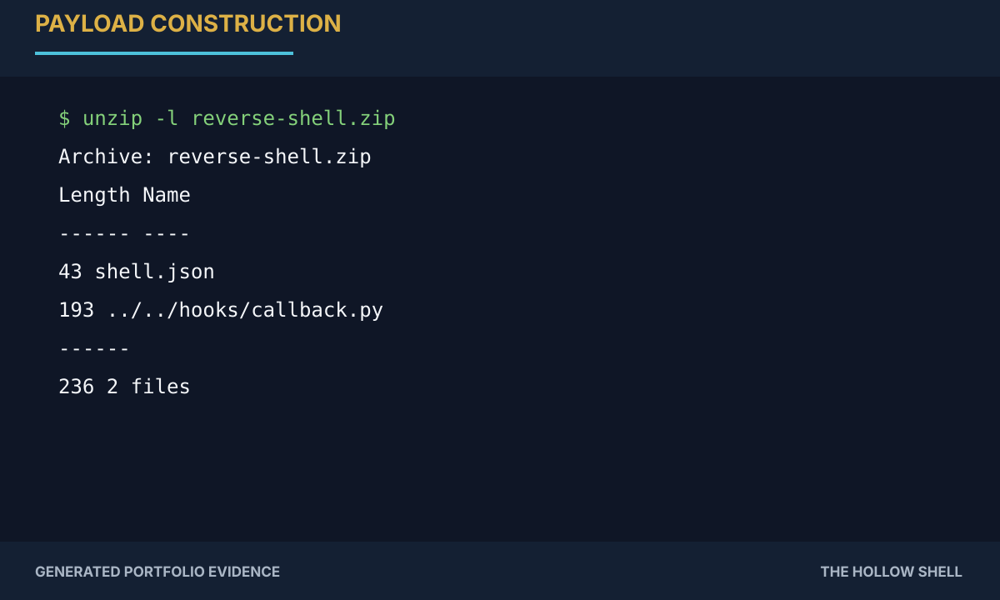

The callback is embedded under a traversed archive path. The attacker listener uses TCP/4444.

### 10 — Obtain the shell

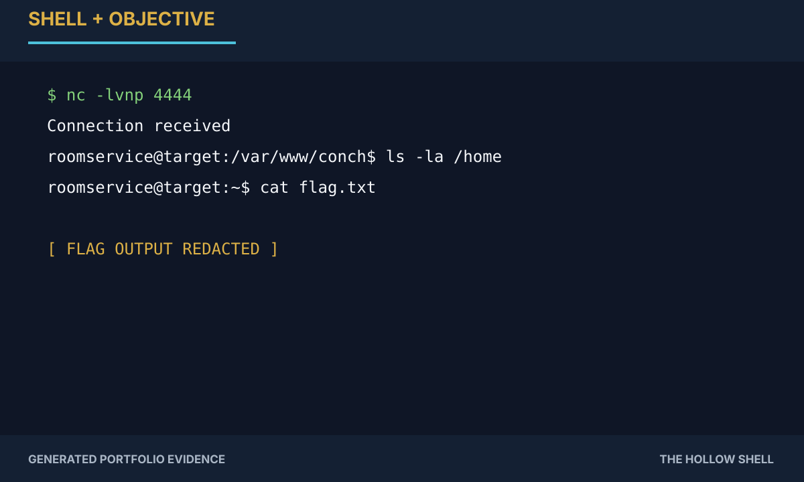

The worker executes the callback and the listener receives the shell. The objective file is read from `/home/roomservice/flag.txt`, but the flag value is not published.

## Root cause

The application failed to enforce a filesystem boundary during ZIP extraction and combined that flaw with a worker that processed executable hooks from a location reachable by the attacker-controlled write primitive.

## Remediation

- Canonicalize every archive member path before writing.
- Reject any destination outside a dedicated extraction root.
- Never execute uploaded Python from a worker-watched directory.
- Separate untrusted upload storage from executable application code.
- Remove credentials and debug comments from production templates.
- Add logging and alerting for traversal sequences and unexpected worker child processes.

## Full report

[Read the complete Markdown documentation](../Documentation/Documentation.md)

[Download the Word report](../Documentation/Documentation.docx)

## References

- [TryHackMe — The Hollow Shell](https://tryhackme.com/room/hh-thehollowshell-ddb582ac)
- [OWASP — Path Traversal](https://owasp.org/www-community/attacks/Path_Traversal)
